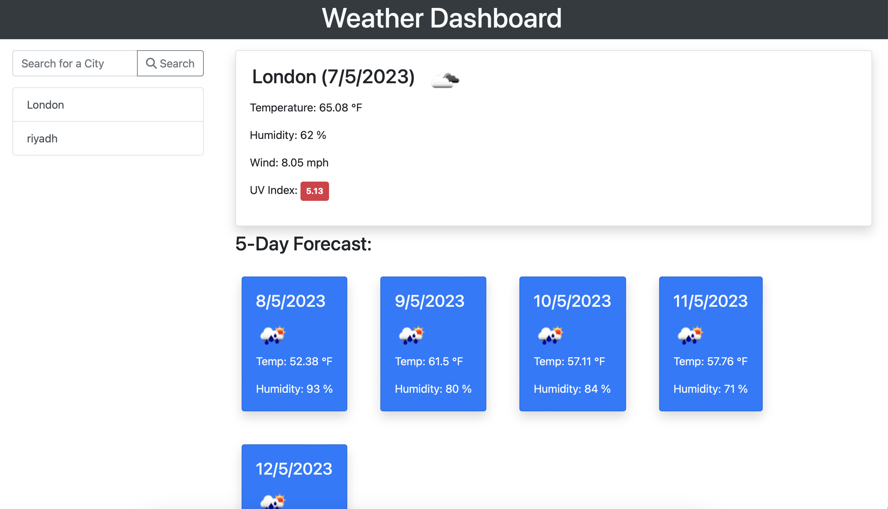

# Check-Your-City-Weather
This is Weather Dashboard to see the live weather and forecast for the next 5 days

## The Task
This week task was to create an app to find out weather in any city of the world.
# User Story
I want to type a city name in the search bar
 
I want to display the current weather
 
I want to see the next 5 days weather

## Approach

HTML and CSS came from bootstrap to style and coding for JS using different resources for help.

## Responsiveness and Media Queries:
fully responsible

## Techenologies:
This is a JavaScrip project.
wit very basic HTML and CSS.

## Deploy:
I deploy this website by using GitHub commands 
Git Clone, git add., git push.
And shared a live link for review.

## License:
I have added a MIT license. This is free website and anyone can use it.

## Links to Repository
Here is the link to repository:
https://github.com/Qasim538/Check-Your-City-Weather

## Links to Application
Here is the link to the online application:
https://github.com/Qasim538/Check-Your-City-Weather/

## Links to my Github
https://github.com/Qasim538

# Preview

